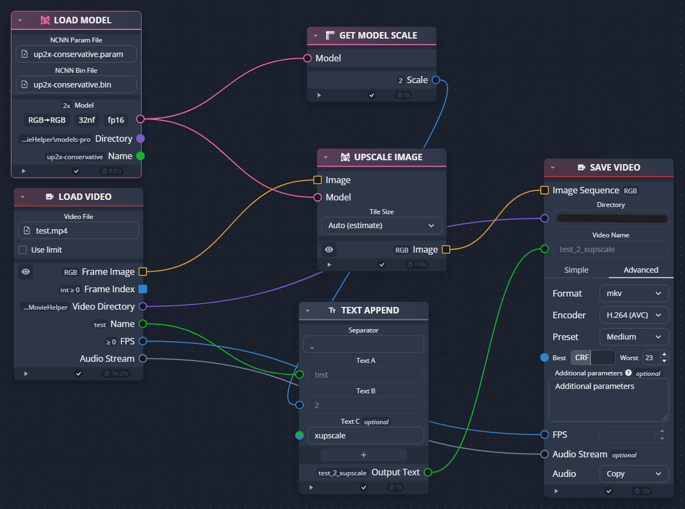

# Real-CUGAN_CreateMovieHelper-Fork

forked from https://github.com/Aerin-the-Lion/Real-CUGAN_CreateMovieHelper
Simply automation tool for Real-CUGAN.

## [お知らせ]
このフォークの更新は終了しました。今後機能追加等のアップデートはしません。
より高機能で様々なモデルが使え、マルチプラットフォームの画像・映像アップスケールソフト[chaiNNer](https://github.com/chaiNNer-org/chaiNNer)をお使いください。

ChaiNNerで動画をアップスケールする例:

NCNNノードでNCNN用の好きなモデル(Real-CUGAN、Real-ESRGANなど)を利用可能です。

## [Forkについて]

- 起動しないバグなどいくつかのバグの修正
- ファイル名に日本語やスペースが入っても大丈夫になった
- デフォルトのコーデックはlibx264
- (Optional)同梱のffmpegはEssentialなので必要ならfull版[ffmpeg](https://www.gyan.dev/ffmpeg/builds/)

## [どんなツール？]
○real-cugan-ncnn-vulkanの処理を簡単操作&自動で動画のアップコンバートを行えるようにするべく作成された補助ツール。
 ・CUIのコマンド操作に不慣れな方が操作しても簡単に作成できるように、対話形式でモデル指定が可能。
 ・Configを用いて予めお好みの設定を用意した上で使用できます。
 ・自前でffmpegのコマンドを打つCUI特有の面倒さ削減にも一役買うのではないかなと思います。

【字幕解説動画】Real-CUGANを動画素材でも誰でも手軽に使えるようにしてみた【自動化ツール配布】(Real-CUGAN-NV-CreateMovieHelper)
https://youtu.be/Q7RjPQU0-X8

## [必要なツール]
 ・FFmpeg(同梱)
 ・real-cugan-ncnn-vulkan(同梱)
 https://github.com/nihui/realcugan-ncnn-vulkan

## [現在の課題]

## [Credit]
Real-CUGAN ncnn Vulkan [link](https://github.com/nihui/realcugan-ncnn-vulkan) \
Copyright (c) 2019 nihui \
Released under the MIT license \
https://opensource.org/license/mit \

Real-CUGAN_CreateMovieHelper [link](https://github.com/Aerin-the-Lion/Real-CUGAN_CreateMovieHelper) \
Copyright (c) 2022 Aerin the Lion(aka. Lost History) \
Released under AGPL-3.0 license \
https://opensource.org/license/agpl-v3 \

